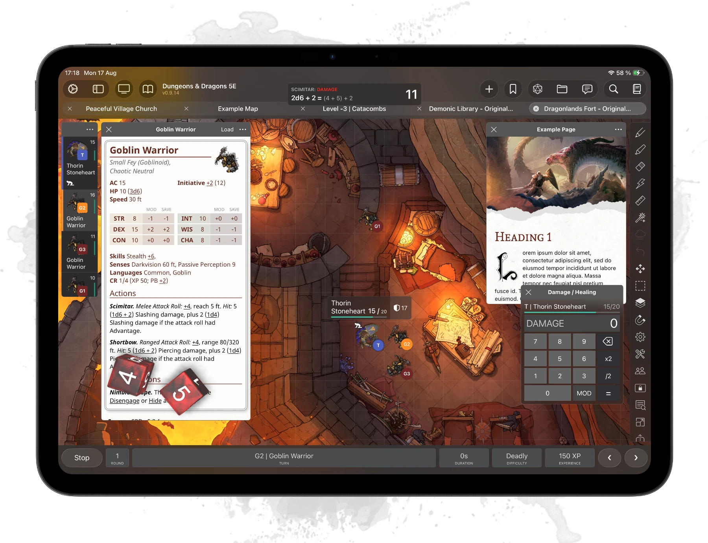

import { Card, CardGrid } from "@astrojs/starlight/components";

**Encounter+ is the app you run your table from.** It keeps your creatures, spells, items and notes
in one library, builds encounters out of them, tracks initiative while you play, and puts a battle
map on the table — with a second, player-facing view for the people sitting across from you.

It runs on iPhone, iPad and Mac, works entirely offline, and stores everything on your own device.

## What it does

<CardGrid>
  <Card title="Library" icon="open-book">
    Creatures, spells, items, players, notes and roll tables, all searchable and filterable. Edit
    anything, or create your own from scratch.
  </Card>
  <Card title="Encounters & initiative" icon="list-format">
    Build an encounter ahead of time or on the fly, roll initiative, and track hit points,
    conditions and turns while you run it.
  </Card>
  <Card title="Battle maps" icon="star">
    Maps with tokens, walls, lighting, line of sight and fog of war, plus drawing tools, markers and
    areas of effect. Available as a one-time purchase.
  </Card>
  <Card title="Player screen" icon="desktop">
    Mirror a player-facing view to a TV or projector over AirPlay or HDMI — the map, the initiative
    order, images and handouts, without your notes.
  </Card>
  <Card title="Remote play" icon="laptop">
    A built-in web server lets players open the map in a browser and move their own tokens from
    anywhere. Part of the Premium subscription.
  </Card>
  <Card title="Dice roller" icon="random">
    A standard roller everywhere a roll is needed, with an optional 3D roller and dice themes for
    Premium subscribers.
  </Card>
  <Card title="Campaigns & modules" icon="document">
    Organise your material into campaigns and modules — adventures, maps, pages and handouts kept
    together and loaded when you need them.
  </Card>
  <Card title="Your own game system" icon="puzzle">
    The app is not hard-wired to one ruleset. A *game system* defines what content types exist and
    how they look, and you can install, switch or build your own.
  </Card>
  <Card title="Works offline" icon="database">
    Everything lives in a local database on your device, so the whole app keeps working with no
    network at all — and it backs itself up on a schedule.
  </Card>
  <Card title="Import & export" icon="cloud-download">
    Bring in modules, campaigns, systems, maps in `.dd2vtt` / `.uvtt` format, CSV files and images —
    and export your own content back out. Legacy XML content still imports.
  </Card>
</CardGrid>

## What you get without paying

Encounter+ runs a complete game out of the box. The library and compendium, creating and editing
content, encounter building, the initiative tracker, campaigns and modules, import and export, roll
tables and the dice roller are all included.

There are **no ads, ever** — not in the free app, and not anywhere else. Nothing is interrupted by
advertising and nothing is unlocked by watching one.

Two purchases add to that: a **one-time Battle Map purchase** unlocks maps, tokens, lighting and
line of sight, and an **optional Premium subscription** adds remote play, 3D dice, animated tiles,
weather effects and early access to new features — mainly as a way to support ongoing development.
See [Purchases](/settings/purchases/) for the details.

## Where to go next

- New here? Start with the [Quick Start](/guides/quick-start/).
- Want the mental model first? [How it works](/guides/how-it-works/) explains the four parts of the
  app in a few minutes.
- Just updated from version 4? Read [Upgrading from Version 4](/about/upgrading/) — there is one
  step to know about.
- Setting up maps? See the [Battle Map guide](/guides/battle-maps/) and
  [Line of Sight](/guides/battle-maps/line-of-sight/).
- Playing with people who aren't in the room? See [Remote Play](/guides/remote-play/).
- Curious about rulesets other than 5E? See [Game Systems](/guides/game-systems/).
- Looking for a specific setting? The [Settings Overview](/settings/overview/) lists every screen.

## More info

For common questions, take a look at the [FAQs](/about/faq/). If your question isn't answered there,
ask on our [Discord](https://discord.gg/psWk84h) or on
[r/EncounterPlus](https://www.reddit.com/r/EncounterPlus/).
