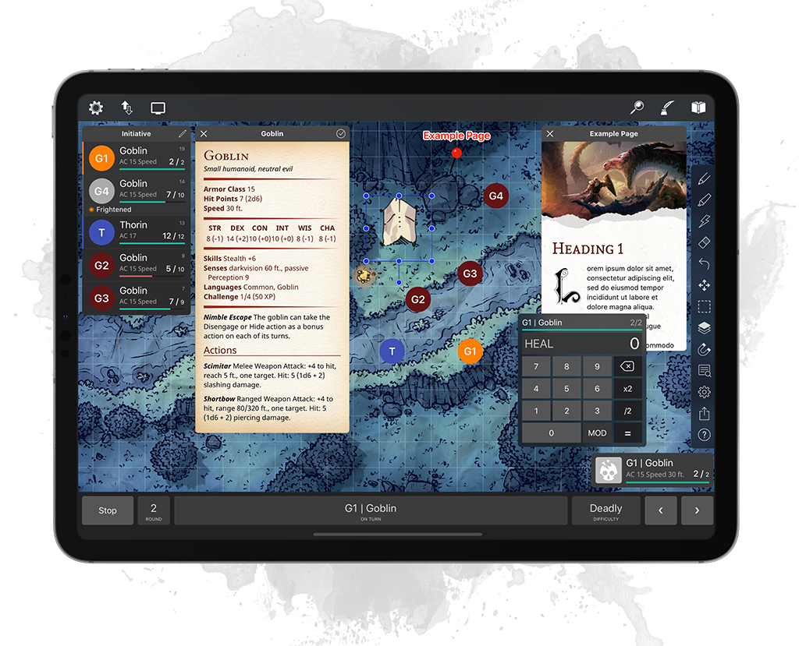

import { Card, CardGrid } from "@astrojs/starlight/components";

some description about the project, what it is, why it exists, etc.

## Features

main features of the project, what it can do, etc.

<CardGrid>
  <Card
    title="Pretty"
    icon="star">
    output is cleaner, friendlier and more colorful. Who doesn't like a
    little color in their terminal?
  </Card>
  <Card
    title="Powerful"
    icon="information">
    providers more features than the competition. It uses a cascading
    config system with specs.
  </Card>
  <Card
    title="Performant"
    icon="rocket">
    is speedy and performant (written in Rust). It continues to be fast
    even with all features enabled.
  </Card>
  <Card
    title="Practical"
    icon="approve-check">
     has sensible defaults and an effortless interface. The CLI is
    fluent, intuitive and memorable.
  </Card>
  <Card
    title="Petite"
    icon="magnifier">
    is a small, single-file, binary executable. It supports both Mac and
    Linux.
  </Card>
  <Card
    title="Pliable"
    icon="setting">
     can be extensively tweaked by power users and pros. Personalise it
    exactly how you like it.
  </Card>
  <Card
    title="Personable"
    icon="puzzle">
    prioritises consumption by humans over scripts. The output is pretty
    and readable, by default.
  </Card>
  <Card
    title="Picturesque"
    icon="seti:image">
     can render high-quality SVG images right in the terminal as file and
    directory icons.
  </Card>
</CardGrid>

You can refer to [our comparison](/about/comparison/) of to other
`ls(1)` alternatives, notably exa/eza.

## More info

For more information, take a look at the [FAQs](/about/faq/). If your question
isn't answered there, feel free to start a
[GitHub discussion](https://github.com/pls-rs/pls/discussions).
